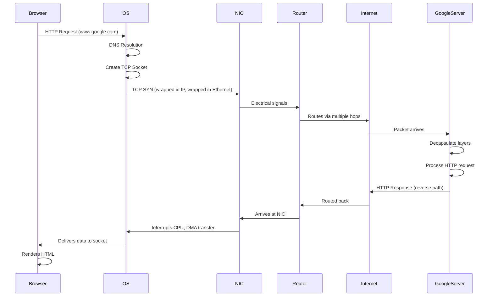
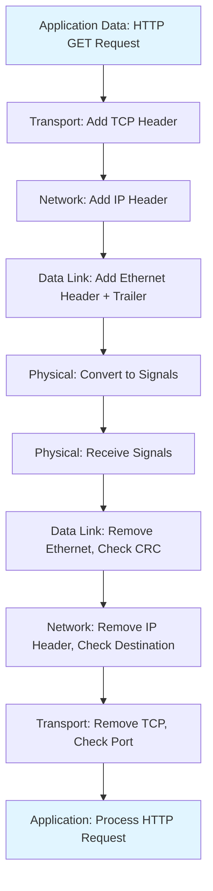
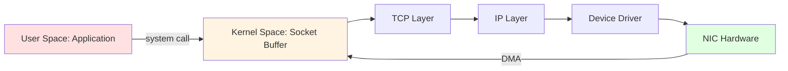
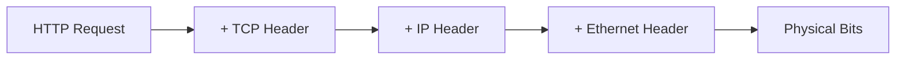
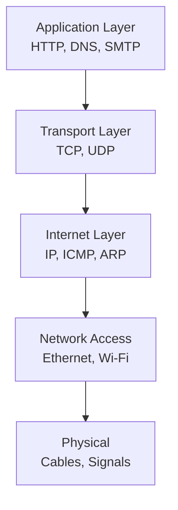

# Network Structure & How the Internet Actually Works

## Phase 1: Concept Foundation

### 1.1 What is a Network Structure Model?

A **network structure model** is a conceptual framework that defines how data flows from one application to another across a network. It breaks down the complex process of network communication into **layers**, where each layer has specific responsibilities.

**Why it exists:**
- Networks are extremely complex (hardware + software + protocols)
- Without standardization, devices from different manufacturers couldn't communicate
- Layering provides **modularity** - changes in one layer don't break others
- Enables **interoperability** across different systems and technologies

**Real networking problem it solves:**
When you send an email from your laptop to someone across the world, multiple tasks must happen:
- Application must format the data
- Data must be broken into packets
- Packets must find the correct route
- Physical signals must travel through cables/wireless
- Error detection and correction must occur

A network model organizes these tasks systematically.

---

### 1.2 Core Principles & Theory

**Fundamental Rules:**

1. **Layering** - Each layer provides services to the layer above and uses services from the layer below
2. **Encapsulation** - Each layer adds its own header (and sometimes trailer) to the data
3. **Abstraction** - Upper layers don't need to know implementation details of lower layers
4. **Standardization** - Protocols at each layer must follow agreed-upon standards

**Key Properties:**

- **Modularity** - Replace one layer's implementation without affecting others
- **Protocol Independence** - Multiple protocols can coexist at the same layer
- **Service Interfaces** - Clear boundaries between layers (APIs, system calls)

**Important Terminology:**

| Term | Definition |
|------|------------|
| **PDU (Protocol Data Unit)** | Data unit at a specific layer (e.g., segment, packet, frame) |
| **Encapsulation** | Wrapping data with protocol headers as it moves down layers |
| **Decapsulation** | Removing headers as data moves up layers |
| **Peer Communication** | Logical communication between same layers on different machines |
| **Service Access Point (SAP)** | Interface between adjacent layers |

---

### 1.3 Real-World Analogy

**Sending a Physical Letter:**

Think of network layers like the postal system:

1. **Application Layer** = You writing the letter content
2. **Presentation Layer** = Translating to a language the recipient understands
3. **Session Layer** = Keeping track of conversation context (letter 1 of 3)
4. **Transport Layer** = Deciding if you need registered mail (TCP) or regular mail (UDP)
5. **Network Layer** = Postal service determining the route (zip code routing)
6. **Data Link Layer** = Local post office handling (street-level delivery)
7. **Physical Layer** = The actual truck/plane/person carrying the letter

Each layer adds its "envelope" (header) with necessary information!

---

## Phase 2: Network Structure Models

### 2.1 OSI Model (Open Systems Interconnection)

**What it is:** A **7-layer** reference model developed by ISO in 1984 to standardize network communication.

**Purpose:** Theoretical framework for understanding networks (not a strict implementation guide).

#### OSI Seven Layers

| Layer # | Layer Name | Function | PDU | Protocols/Examples |
|---------|------------|----------|-----|-------------------|
| **7** | **Application** | User interface, network services | Data | HTTP, FTP, SMTP, DNS |
| **6** | **Presentation** | Data translation, encryption, compression | Data | SSL/TLS, JPEG, ASCII |
| **5** | **Session** | Manages sessions, dialog control | Data | NetBIOS, PPTP |
| **4** | **Transport** | Reliable delivery, segmentation, flow control | Segment (TCP) / Datagram (UDP) | TCP, UDP |
| **3** | **Network** | Logical addressing, routing | Packet | IP, ICMP, IGMP, ARP |
| **2** | **Data Link** | Physical addressing, frame formatting, error detection | Frame | Ethernet, Wi-Fi (802.11), PPP |
| **1** | **Physical** | Transmission of raw bits over physical medium | Bit | Cables, hubs, electrical signals |

**Layer-by-Layer Breakdown:**

**Layer 7 - Application Layer**
- Provides network services directly to end-users
- Examples: Web browsers (HTTP), Email clients (SMTP), File transfer (FTP)
- No data formatting, just high-level protocols

**Layer 6 - Presentation Layer**
- Data translation between application and network formats
- Encryption/decryption (SSL/TLS)
- Compression/decompression
- Character encoding (ASCII, Unicode)

**Layer 5 - Session Layer**
- Establishes, manages, and terminates sessions
- Synchronization and dialog control
- Checkpointing and recovery
- Example: Video call session management

**Layer 4 - Transport Layer**
- **Segmentation** - breaks data into smaller units
- **End-to-end communication** between processes
- **Port addressing** (source and destination ports)
- **Error control** and **flow control**
- TCP (reliable) vs UDP (unreliable)

**Layer 3 - Network Layer**
- **Logical addressing** (IP addresses)
- **Routing** - path determination
- **Packet forwarding**
- Handles internetwork communication

**Layer 2 - Data Link Layer**
- **Physical addressing** (MAC addresses)
- **Framing** - packages bits into frames
- **Error detection** (CRC)
- **Media access control** (who can transmit when)
- Sublayers: LLC (Logical Link Control) and MAC (Media Access Control)

**Layer 1 - Physical Layer**
- **Bit transmission** over physical medium
- Defines electrical signals, cable types, connector pins
- Hub, repeater, cables, network interface cards
- No addressing, just raw bit stream

---

### 2.2 TCP/IP Model (Internet Protocol Suite)

**What it is:** A **4-layer** (or 5-layer) practical implementation model that powers the actual Internet.

**Why it dominates:** Developed by DARPA for real-world military networks; proven, practical, and scalable.

#### TCP/IP Four Layers

| Layer # | Layer Name | Function | Equivalent OSI Layers | Protocols |
|---------|------------|----------|----------------------|-----------|
| **4** | **Application** | High-level protocols, user services | 5, 6, 7 | HTTP, FTP, SMTP, DNS, SSH |
| **3** | **Transport** | Host-to-host communication | 4 | TCP, UDP, SCTP |
| **2** | **Internet** | Routing and logical addressing | 3 | IP, ICMP, ARP, IGMP |
| **1** | **Network Access** | Physical transmission and MAC | 1, 2 | Ethernet, Wi-Fi, PPP |

**Key Differences from OSI:**

| Aspect | OSI Model | TCP/IP Model |
|--------|-----------|--------------|
| **Layers** | 7 layers | 4 layers (sometimes 5) |
| **Development** | Theoretical first, then implementation | Implementation first, then model |
| **Usage** | Reference model | Actual Internet standard |
| **Session/Presentation** | Separate layers | Merged into Application layer |
| **Reliability** | Can be in Data Link or Transport | Only in Transport (TCP) |
| **Adoption** | Educational standard | Industry standard |

---

### 2.3 Hybrid 5-Layer Model (Modern Teaching Model)

Many modern textbooks use a **5-layer** practical model:

1. **Application** - HTTP, DNS, SMTP
2. **Transport** - TCP, UDP
3. **Network** - IP, ICMP, routing
4. **Data Link** - Ethernet, Wi-Fi, MAC addressing
5. **Physical** - Cables, signals, bits

This is essentially TCP/IP with the Network Access layer split into Data Link and Physical.

---

### 2.4 Other Network Models

#### AppleTalk Model
- Proprietary Apple networking (1980s-90s)
- Similar layering to OSI
- Now obsolete (replaced by TCP/IP)

#### NetWare (Novell) Model
- IPX/SPX protocol suite
- Popular in 1990s corporate networks
- Replaced by TCP/IP

#### SNA (Systems Network Architecture)
- IBM's proprietary model (1974)
- 7 layers similar to OSI
- Used in mainframe environments
- Still used in legacy banking/enterprise systems

---

## Phase 3: How the Internet Actually Works - Internal Mechanics

### 3.1 The Complete Journey of Data

Let's trace what happens when you type `www.google.com` in your browser:

#### Step 1: Application Layer (Your Browser)

```
User action: Types URL and presses Enter
Browser creates HTTP request:
GET / HTTP/1.1
Host: www.google.com
```

**What happens internally:**
- Browser checks its cache for the IP address of google.com
- If not cached, initiates DNS resolution

---

#### Step 2: DNS Resolution (Application Layer)

**Goal:** Convert `www.google.com` → IP address (e.g., `142.250.185.46`)

```
Process:
1. Browser → OS resolver → Local DNS cache
2. If not found → Recursive DNS server (ISP)
3. Recursive server → Root DNS server → TLD server (.com) → Authoritative server
4. Returns IP address
```

**Packet format at this stage:**
```
DNS Query Packet:
- Transaction ID
- Question: www.google.com, Type A (IPv4 address)
```

---

#### Step 3: Transport Layer - TCP Connection

**TCP Three-Way Handshake:**

```
Client (Your PC)          Google Server
    |                          |
    |-------- SYN ------------>|  (Seq=X, I want to connect)
    |                          |
    |<------- SYN-ACK ---------|  (Seq=Y, Ack=X+1, OK!)
    |                          |
    |-------- ACK ------------>|  (Ack=Y+1, Connection established)
```

**What the OS does:**
1. Creates a **socket** (IP + Port combination)
2. Allocates **send and receive buffers** in kernel memory
3. Initializes **TCP control block** (stores connection state)
4. Selects **ephemeral source port** (e.g., 54321)
5. Destination port = 80 (HTTP) or 443 (HTTPS)

**TCP Segment structure:**
```
+------------------+
| Source Port      | (2 bytes)
| Dest Port        | (2 bytes)
| Sequence Number  | (4 bytes)
| Ack Number       | (4 bytes)
| Flags (SYN, ACK) | 
| Window Size      |
| Checksum         |
| Urgent Pointer   |
| Options          |
+------------------+
| Data (HTTP req)  |
+------------------+
```

---

#### Step 4: Network Layer - IP Routing

**IP Packet Creation:**

The OS network stack takes the TCP segment and wraps it in an **IP packet**:

```
+----------------------+
| IP Header            |
|  - Source IP         | (Your PC's IP: 192.168.1.5)
|  - Dest IP           | (Google: 142.250.185.46)
|  - TTL               | (e.g., 64 hops)
|  - Protocol          | (6 = TCP)
|  - Checksum          |
+----------------------+
| TCP Segment          |
+----------------------+
```

**Routing decision:**
1. OS checks **routing table**:
   ```
   Destination     Gateway         Interface
   0.0.0.0/0       192.168.1.1     eth0  (Default route)
   192.168.1.0/24  0.0.0.0         eth0  (Local network)
   ```

2. Since Google's IP is not local, packet goes to **default gateway** (your home router)

3. **ARP (Address Resolution Protocol)** resolves gateway's MAC address:
   ```
   Who has 192.168.1.1? Tell 192.168.1.5
   → Router responds: 192.168.1.1 is at MAC aa:bb:cc:dd:ee:ff
   ```

---

#### Step 5: Data Link Layer - Frame Creation

**Ethernet Frame:**

```
+-------------------+
| Dest MAC          | (Router's MAC)
| Source MAC        | (Your NIC's MAC)
| EtherType         | (0x0800 = IPv4)
+-------------------+
| IP Packet         |
+-------------------+
| Frame Check Seq   | (CRC checksum)
+-------------------+
```

**What your Network Interface Card (NIC) does:**
1. Receives frame from OS via **DMA (Direct Memory Access)**
2. Converts digital data to **electrical signals** (for Ethernet) or **radio waves** (for Wi-Fi)
3. Transmits onto physical medium

---

#### Step 6: Physical Layer - Signal Transmission

**For Ethernet (Wired):**
- Bits encoded as voltage levels on copper wire
- Manchester encoding or 4B/5B encoding
- Travels at near speed of light through cable

**For Wi-Fi (Wireless):**
- Bits modulated onto radio frequency carrier waves
- OFDM (Orthogonal Frequency Division Multiplexing)
- Carrier Sense Multiple Access with Collision Avoidance (CSMA/CA)

---

### 3.2 Journey Through the Internet

```
Your PC → Home Router → ISP Router → Internet Backbone → Google's Edge Router → Google Server
```

**At each router:**

1. **Receives frame** on input interface
2. **Decapsulates** (removes Data Link header)
3. **Reads destination IP** from Network Layer
4. **Looks up routing table** to determine next hop
5. **Decrements TTL** (Time To Live)
6. **Re-encapsulates** in new frame for next hop
7. **Transmits** on output interface

**Traceroute visualization:**

```
traceroute to google.com (142.250.185.46)
1  192.168.1.1        2ms   (Home router)
2  10.0.0.1          15ms   (ISP router)
3  72.14.215.203     28ms   (ISP backbone)
4  142.250.185.46    35ms   (Google edge)
```

---

### 3.3 Arriving at Google's Server

**Google's server:**

1. **NIC receives** physical signals
2. **Data Link layer** checks MAC address, strips frame
3. **Network layer** verifies IP destination
4. **Transport layer** delivers to correct socket (port 80/443)
5. **Application layer** (web server software like Apache/nginx) processes HTTP request
6. **Generates HTTP response** with HTML content
7. **Entire process reverses** to send response back

---

### 3.4 Visual Flow Diagram



---

### 3.5 Encapsulation & Decapsulation



---

### 3.6 Memory & Buffer Flow in OS

**When you send data:**

1. **Application** writes to socket via `send()` system call
2. Data copied from **user space** to **kernel space** (socket send buffer)
3. **TCP layer** chunks data into segments (MSS = Maximum Segment Size)
4. **IP layer** fragments if needed (MTU = Maximum Transmission Unit)
5. **Device driver** transfers to NIC via DMA
6. **NIC transmits** and sends interrupt when done

**When you receive data:**

1. **NIC** receives frame, writes to **ring buffer** via DMA
2. **Sends hardware interrupt** to CPU
3. **Interrupt handler** processes frame up the stack
4. **Data copied** to socket receive buffer
5. **Application** reads via `recv()` system call



---

## Phase 4: Practical Design Perspective

### 4.1 Design Implications

**Why layering matters in system design:**

1. **Modularity** - You can swap Ethernet for Wi-Fi without changing TCP
2. **Debugging** - Use `tcpdump` to inspect specific layers
3. **Security** - Add encryption at different layers (TLS at Transport, IPSec at Network)
4. **Optimization** - Tune parameters at each layer independently

**When to think about layers:**

- **Application developer** - Mostly care about Application layer (HTTP APIs)
- **Network engineer** - Focus on Network + Data Link (routing, switching)
- **System programmer** - Transport layer (socket programming, TCP tuning)
- **Hardware engineer** - Physical layer (cables, signal processing)

---

### 4.2 Trade-offs

| Design Choice | Pros | Cons |
|---------------|------|------|
| **More layers (OSI)** | Clear separation, easier to understand | More overhead, complex implementation |
| **Fewer layers (TCP/IP)** | Faster, practical | Less modular, harder to teach |
| **End-to-end principle** (intelligence at edges) | Simple core network, innovation at edges | Security challenges, no QoS guarantees |
| **Hop-by-hop reliability** | Better error handling | More complexity, slower |

**Performance considerations:**

- Each layer adds **header overhead** (~5-10% of payload)
- **Context switching** between layers costs CPU cycles
- **Buffering** at each layer increases latency but improves throughput

---

### 4.3 Common Mistakes & Pitfalls

❌ **Mistake 1:** Thinking OSI is how the Internet works
- **Reality:** TCP/IP is the actual implementation; OSI is just a reference

❌ **Mistake 2:** Confusing IP address with MAC address
- **IP address** = Logical (can change, used for routing across networks)
- **MAC address** = Physical (burned into NIC, used for local delivery)

❌ **Mistake 3:** Assuming layers are strictly independent
- **Reality:** Cross-layer optimization happens (e.g., TCP uses IP MTU info)

❌ **Mistake 4:** Forgetting about ARP
- Before sending to local gateway, must resolve MAC via ARP

❌ **Mistake 5:** Not understanding NAT breaks end-to-end model
- **NAT** (Network Address Translation) modifies IP headers, violates layering

---

## Phase 5: Interview Mastery

### 5.1 Frequently Asked Interview Questions

#### Conceptual Questions

**Q1: Explain the OSI model layers with examples.**

**Answer:** 
- **Physical:** Cables, hubs - transmits raw bits
- **Data Link:** Ethernet, switches, MAC addresses - local network delivery
- **Network:** IP, routers - internetwork routing
- **Transport:** TCP/UDP, ports - end-to-end reliability
- **Session:** Session management (less used today)
- **Presentation:** Encryption, compression (often merged with Application)
- **Application:** HTTP, DNS, SMTP - user-facing protocols

---

**Q2: What's the difference between OSI and TCP/IP models?**

**Answer:**

| Aspect | OSI | TCP/IP |
|--------|-----|--------|
| Layers | 7 | 4 (or 5) |
| Approach | Theory first | Practical implementation |
| Session/Presentation | Separate | Merged into Application |
| Usage | Teaching | Real Internet |

---

**Q3: How does data travel from your browser to a web server?**

**Answer (step-by-step):**
1. **DNS resolution** - Convert domain to IP
2. **TCP handshake** - Establish connection (SYN, SYN-ACK, ACK)
3. **HTTP request** - Browser sends GET request
4. **Encapsulation** - Each layer adds headers (TCP → IP → Ethernet)
5. **Routing** - Routers forward based on IP
6. **Decapsulation** - Server strips headers layer by layer
7. **Response** - Server sends HTTP response back via reverse path

---

**Q4: What happens when you type a URL in the browser?**

**Complete answer:**
1. Browser checks **cache** for DNS
2. If not found, sends **DNS query** to resolver
3. DNS returns **IP address**
4. Browser initiates **TCP connection** (3-way handshake)
5. Sends **HTTP/HTTPS request**
6. Request passes through **layers** (encapsulation)
7. Routers use **routing tables** to forward packets
8. Server **decapsulates**, processes request
9. Server sends **HTTP response**
10. Browser receives data, **renders** page

---

#### Scenario-Based Questions

**Q5: A packet is getting lost between two routers. Which layer would you check first and why?**

**Answer:**
- First check **Network layer** (Layer 3) - verify routing tables
- Then **Data Link layer** (Layer 2) - check for CRC errors, collisions
- Finally **Physical layer** (Layer 1) - cable issues, signal degradation

---

**Q6: Why does TCP use port numbers when IP already has addresses?**

**Answer:**
- **IP addresses** identify **devices**
- **Port numbers** identify **specific applications/processes** on that device
- Example: Server at 192.168.1.10 might run web server (port 80), email (port 25), SSH (port 22)
- Without ports, how would the OS know which application to deliver data to?

---

**Q7: What is encapsulation and why is it important?**

**Answer:**
- **Encapsulation** = Each layer adds its own header (and trailer)
- Allows **layer independence** - each layer only needs to understand its own header
- **Example:** 
  - Application creates data
  - Transport adds TCP header (ports, sequence numbers)
  - Network adds IP header (source/dest IPs)
  - Data Link adds Ethernet header (MAC addresses)
  
**Importance:** Modularity, flexibility, troubleshooting

---

#### Tricky Edge Cases

**Q8: Can two devices communicate if they're on different Data Link protocols (Ethernet vs Wi-Fi)?**

**Answer:** 
- **Yes!** This is the beauty of layering
- Router acts as intermediary:
  - Receives frame on Ethernet interface (strips Ethernet header)
  - Reads IP packet
  - Re-encapsulates in Wi-Fi frame
  - Transmits on Wi-Fi interface
- **Network layer provides abstraction** over different physical networks

---

**Q9: Why do we need both MAC addresses and IP addresses?**

**Answer:**

| MAC Address | IP Address |
|-------------|------------|
| **Physical** - burned into NIC | **Logical** - assigned by network admin |
| **Local scope** - only valid on LAN | **Global scope** - works across Internet |
| **Flat** - no hierarchy | **Hierarchical** - enables routing |
| **Layer 2** | **Layer 3** |

**Example:** When you move your laptop to a new network:
- MAC stays the same (hardware)
- IP changes (assigned by new network's DHCP)

---

**Q10: What's the purpose of TTL (Time To Live) in IP packets?**

**Answer:**
- Prevents **infinite routing loops**
- Each router decrements TTL by 1
- If TTL reaches 0, packet is **dropped**
- Router sends **ICMP Time Exceeded** message back to source
- **Default:** Usually 64 or 128

**Interview insight:** `traceroute` exploits this by sending packets with increasing TTL values

---

### 5.2 One-Page Quick Revision Summary

#### Core Definitions

| Term | Definition |
|------|------------|
| **OSI Model** | 7-layer reference model (Application → Physical) |
| **TCP/IP Model** | 4-layer practical Internet model |
| **Encapsulation** | Adding headers as data moves down layers |
| **PDU** | Protocol Data Unit (segment, packet, frame, bit) |

---

#### Layer Comparison

| OSI Layer | TCP/IP Layer | Function | PDU |
|-----------|--------------|----------|-----|
| 7. Application | Application | User services | Data |
| 6. Presentation | Application | Encryption, formatting | Data |
| 5. Session | Application | Session management | Data |
| 4. Transport | Transport | End-to-end delivery | Segment |
| 3. Network | Internet | Routing, IP addressing | Packet |
| 2. Data Link | Network Access | MAC addressing, framing | Frame |
| 1. Physical | Network Access | Bit transmission | Bit |

---

#### Key Protocols by Layer

```
Application:  HTTP, HTTPS, FTP, SMTP, DNS, SSH
Transport:    TCP, UDP
Network:      IP, ICMP, ARP, IGMP
Data Link:    Ethernet, Wi-Fi (802.11), PPP
Physical:     Cables, signals, hubs
```

---

#### Critical Flow: Browser → Server

```
1. DNS resolution → IP address
2. TCP 3-way handshake → Connection established
3. HTTP request → Encapsulated (TCP → IP → Ethernet)
4. Routing → Multiple hops via routers
5. Decapsulation → Server receives data
6. HTTP response → Reverse path
```

---

#### Common Interview Traps

✅ **Remember:**
- OSI is theory, TCP/IP is reality
- IP = device, Port = application
- MAC = local, IP = global
- TTL prevents loops
- ARP resolves IP → MAC on local network

---

#### Essential Mermaid Diagrams

**Encapsulation:**



**TCP/IP Stack:**



---

#### Final Checklist for Interviews

- [ ] Can explain OSI 7 layers with examples
- [ ] Know difference between OSI and TCP/IP
- [ ] Understand encapsulation/decapsulation
- [ ] Can trace packet from browser to server
- [ ] Know why we need both MAC and IP
- [ ] Understand DNS, TCP handshake, HTTP flow
- [ ] Can explain routing vs switching
- [ ] Know common port numbers (80, 443, 22, 25)

---

**Remember:** Layering is about **separation of concerns**. Each layer solves a specific problem and provides services to the layer above!
