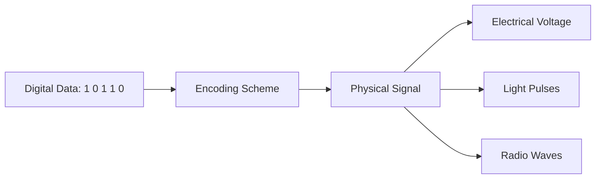
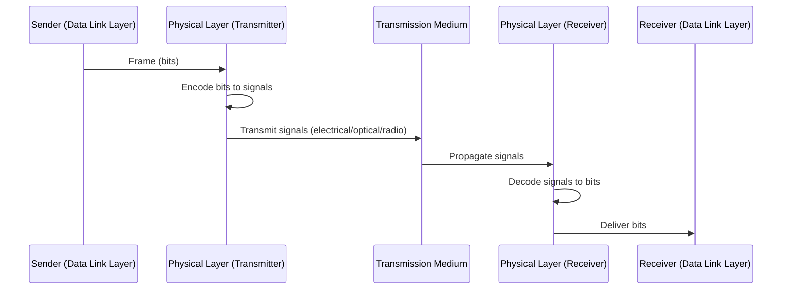
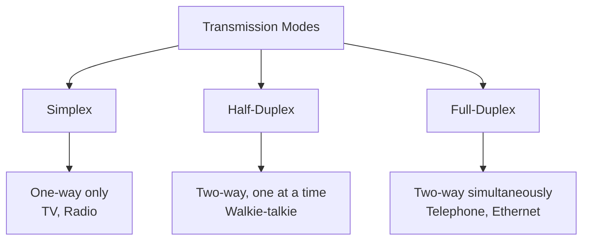
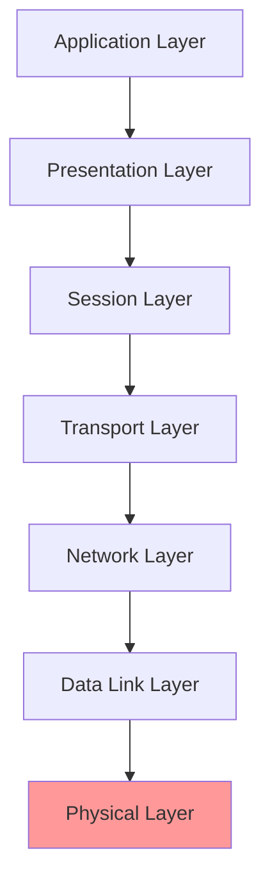

# Physical Layer (Layer 1) - Complete Reference

## Phase 1: Concept Foundation

### Concept Definition

**What is the Physical Layer?**
The **Physical Layer** is the **first and lowest layer** of the OSI model. It is responsible for the **physical transmission of raw bits** (0s and 1s) over a physical medium such as cables, fiber optics, or wireless channels.

**Why Does It Exist?**
- Converts digital data into physical signals (electrical, optical, or radio waves)
- Defines hardware specifications and transmission media
- Establishes physical connectivity between devices
- Enables actual data transmission across networks

**What Problem Does It Solve?**
Without the Physical Layer, there would be no way to **physically transmit data** between devices. It bridges the gap between digital data and physical transmission media.

---

### Core Principles

**Fundamental Rules:**
1. **Bit-level transmission**: Deals only with raw binary bits (0s and 1s)
2. **Signal encoding**: Converts bits into signals (voltage, light pulses, radio waves)
3. **Physical medium**: Defines cables, connectors, and topology
4. **Unidirectional/Bidirectional**: Can support simplex, half-duplex, or full-duplex communication
5. **No error correction**: Only transmits; doesn't check or correct errors

**Key Properties:**
| Property | Description |
|----------|-------------|
| **Data Unit** | Bits (0 and 1) |
| **Transmission Mode** | Simplex, Half-Duplex, Full-Duplex |
| **Media Types** | Electrical cables, Optical fiber, Wireless |
| **Devices** | Repeater, Hub, Cables, Connectors |
| **Standards** | RS-232, V.35, Ethernet physical specs |

**Important Terminology:**
- **Bandwidth**: Maximum data transfer rate
- **Bit Rate**: Number of bits transmitted per second (bps)
- **Signal Encoding**: NRZ, Manchester, Differential Manchester
- **Topology**: Physical layout (Bus, Star, Ring, Mesh)
- **Attenuation**: Signal loss over distance

---

### Real-World Analogy

**Physical Layer = The Road System**

Imagine sending a package across a city:
- **Bits = Vehicles** traveling on roads
- **Cables = Roads and highways** that vehicles travel on
- **Signal encoding = Traffic rules** (left-hand vs right-hand drive)
- **Repeater = Gas station** that refuels vehicles for longer journeys
- **Hub = Intersection** where all roads meet and traffic passes through

The road system doesn't care what's inside the vehicles—it just ensures they can physically travel from point A to point B.

---

## Phase 2: Protocol / Mechanism Explanation

### Purpose
- **Physical transmission** of bits between devices
- **Signal synchronization** between sender and receiver
- **Medium specification**: Defines cables, connectors, voltage levels

### Responsibilities
1. **Bit transmission**: Send 0s and 1s as electrical/optical/radio signals
2. **Encoding/Decoding**: Convert bits to signals and vice versa
3. **Physical topology**: Define how devices are physically connected
4. **Data rate control**: Determine transmission speed (bps, Mbps, Gbps)
5. **Transmission mode**: Simplex, Half-Duplex, Full-Duplex

### Constraints and Guarantees
- **No error detection or correction**
- **No addressing**: Doesn't know source or destination
- **Media-dependent**: Performance depends on cable type and quality
- **Distance limitations**: Signal degrades over long distances (attenuation)

---

## Phase 3: Internal Mechanics (Under the Hood)

### Transmission Media Types

**1. Electrical Cables (Copper)**
- **Twisted Pair Cable**: Cat5, Cat6, Cat7 (Ethernet)
- **Coaxial Cable**: Used in cable TV and older networks
- **Encoding**: Voltage levels represent 0 and 1
  - High voltage = 1
  - Low voltage = 0

**2. Optical Fiber Cables**
- **Single-mode fiber**: Long-distance, single light ray
- **Multi-mode fiber**: Short-distance, multiple light rays
- **Encoding**: Light pulses
  - Light ON = 1
  - Light OFF = 0
- **Advantages**: High speed, no electromagnetic interference, long distance

**3. Wireless Media**
- **Radio waves, Microwaves, Infrared**
- Used in Wi-Fi, Bluetooth, cellular networks
- **Encoding**: Frequency modulation

---

### Signal Encoding Schemes

**Common Encoding Techniques:**
1. **NRZ (Non-Return to Zero)**
   - High voltage = 1, Low voltage = 0
2. **Manchester Encoding**
   - Transition in the middle of bit period
   - Rising edge = 0, Falling edge = 1
3. **Differential Manchester**
   - Presence of transition = 0, Absence = 1

---

### Bit Transmission Flow

---

### Transmission Modes

| Mode | Description | Example |
|------|-------------|---------|
| **Simplex** | One-way communication only | TV broadcast, Radio |
| **Half-Duplex** | Two-way, but one at a time | Walkie-talkie, CB radio |
| **Full-Duplex** | Two-way simultaneously | Telephone, Ethernet |

---

## Phase 4: Design & Performance Perspective

### Why Designed This Way?

**Separation of Concerns:**
- Physical Layer focuses **only on bit transmission**
- Higher layers handle addressing, error control, and application logic
- Modularity: Can upgrade physical medium without changing upper layers

**Media Diversity:**
- Different applications need different media (copper for LANs, fiber for long distance)
- Physical Layer abstracts these differences

---

### Trade-offs

| Factor | Electrical Cables | Optical Fiber | Wireless |
|--------|------------------|---------------|----------|
| **Speed** | Moderate (1-10 Gbps) | Very High (10-100 Gbps) | Moderate (100 Mbps - 1 Gbps) |
| **Distance** | Short (100m for Ethernet) | Long (100+ km) | Medium (depends on power) |
| **Cost** | Low | High | Low-Medium |
| **Interference** | Susceptible (EMI) | Immune | Susceptible |
| **Security** | Medium | High (hard to tap) | Low (broadcasts) |

---

### Performance Considerations

**Latency:**
- **Propagation delay**: Time for signal to travel through medium
- **Transmission delay**: Time to push all bits onto the wire
- **Formula**: Latency = Propagation Delay + Transmission Delay

**Bandwidth vs. Throughput:**
- **Bandwidth**: Maximum capacity of the medium (theoretical)
- **Throughput**: Actual data transfer rate (practical, always less than bandwidth)

**Attenuation and Amplification:**
- Signals weaken over distance
- **Repeaters** regenerate signals for longer distances

---

## Phase 5: Failures & Pitfalls

### Common Failures

1. **Signal Attenuation**
   - **Problem**: Signal weakens over long cables
   - **Solution**: Use repeaters or shorter cable runs

2. **Electromagnetic Interference (EMI)**
   - **Problem**: Electrical noise distorts signals
   - **Solution**: Use shielded cables or fiber optics

3. **Cable Damage**
   - **Problem**: Physical breaks, kinks, or connector issues
   - **Solution**: Regular inspection and proper installation

4. **Incorrect Encoding**
   - **Problem**: Sender and receiver use different encoding schemes
   - **Solution**: Standardized protocols (e.g., IEEE 802.3 for Ethernet)

---

### Edge Cases

- **Crosstalk**: Signals from one cable interfere with another (use twisted pair)
- **Collisions in shared media**: Multiple devices transmit simultaneously (solved by CSMA/CD)
- **Speed mismatch**: Devices with different bit rates (negotiated by auto-negotiation)

---

### Interview Traps

**Q: Does the Physical Layer perform error checking?**
❌ **Wrong Answer**: Yes, it uses checksums.
✅ **Correct Answer**: No, the Physical Layer only transmits bits. Error checking is done at the Data Link Layer (CRC) and Transport Layer (checksum).

**Q: Can the Physical Layer route packets?**
❌ **Wrong Answer**: Yes, it uses IP addresses.
✅ **Correct Answer**: No, routing happens at the Network Layer (Layer 3). The Physical Layer has no concept of addressing.

---

## Phase 6: Interview Mastery

### Frequently Asked Questions

**Conceptual:**

**Q1: What is the role of the Physical Layer?**
**A1**: The Physical Layer transmits raw bits over a physical medium. It converts digital data into electrical, optical, or radio signals and handles the physical connection between devices.

**Q2: What are the three main transmission media?**
**A2**: 
1. **Electrical cables** (copper, twisted pair, coaxial)
2. **Optical fiber** (single-mode and multi-mode)
3. **Wireless** (radio waves, microwaves, infrared)

**Q3: What is the difference between bandwidth and throughput?**
**A3**: 
- **Bandwidth**: Maximum theoretical data rate of the medium
- **Throughput**: Actual data rate achieved in practice (always ≤ bandwidth due to overhead and interference)

---

**Scenario-Based:**

**Q1: Why can't we use a 200-meter Ethernet cable without a repeater?**
**A1**: Ethernet (Cat5/Cat6) has a maximum cable length of **100 meters** due to **signal attenuation**. Beyond this, the signal weakens and becomes unreadable. A **repeater** regenerates the signal for longer distances.

**Q2: Your network is experiencing frequent disconnections. How would you troubleshoot at the Physical Layer?**
**A2**: Check:
1. Cable integrity (damage, kinks, loose connectors)
2. Signal quality (attenuation, interference)
3. Cable length (exceeds maximum?)
4. Device compatibility (speed, duplex settings)

**Q3: Why is optical fiber preferred for long-distance communication?**
**A3**: Optical fiber has:
- **Minimal attenuation** (signals travel 100+ km without repeaters)
- **No electromagnetic interference**
- **High bandwidth** (10-100 Gbps)
- **Secure** (difficult to tap)

---

**Tricky Cases:**

**Q1: If the Physical Layer only transmits bits, how does synchronization happen?**
**A1**: Synchronization is achieved through:
- **Encoding schemes** (Manchester encoding embeds clock in signal)
- **Preamble and Start Frame Delimiter** (at Data Link Layer)
- **Physical Layer standards** define clock rates

**Q2: Can two devices with different Physical Layer technologies communicate?**
**A2**: Not directly. They need a **gateway or media converter** that translates between different physical media (e.g., copper-to-fiber converter).

---

### One-Page Revision

**Key Definitions:**

| Term | Definition |
|------|------------|
| **Physical Layer** | Transmits raw bits over physical media |
| **Bit** | Smallest unit: 0 or 1 |
| **Signal Encoding** | Converting bits to electrical/optical/radio signals |
| **Attenuation** | Signal loss over distance |
| **Bandwidth** | Maximum data rate of medium |
| **Throughput** | Actual achieved data rate |

---

**Transmission Media Summary:**

| Media | Speed | Distance | Cost | Use Case |
|-------|-------|----------|------|----------|
| Twisted Pair | 1-10 Gbps | 100m | Low | LANs |
| Optical Fiber | 10-100 Gbps | 100+ km | High | Long-distance, backbone |
| Wireless | 100 Mbps - 1 Gbps | Varies | Low | Mobile, Wi-Fi |

---

**Transmission Modes:**

---

**Physical Layer Stack Position:**

---

**Quick Revision Points:**
- ✅ **Transmits bits** as electrical/optical/radio signals
- ✅ **No error checking** (done by upper layers)
- ✅ **No addressing** (MAC at Data Link, IP at Network)
- ✅ **Media-dependent** (copper, fiber, wireless)
- ✅ **Distance limitation** due to attenuation
- ✅ **Devices**: Repeater, Hub, Cables
- ✅ **Encoding**: NRZ, Manchester
- ✅ **Modes**: Simplex, Half-Duplex, Full-Duplex

---

**Remember for Interviews:**
1. Physical Layer = **Bit transmission only**
2. Three media types: **Electrical, Optical, Wireless**
3. No intelligence: **No routing, no addressing, no error control**
4. Attenuation = Signal weakens → Use **repeaters**
5. Fiber > Copper for **long distance and high speed**
